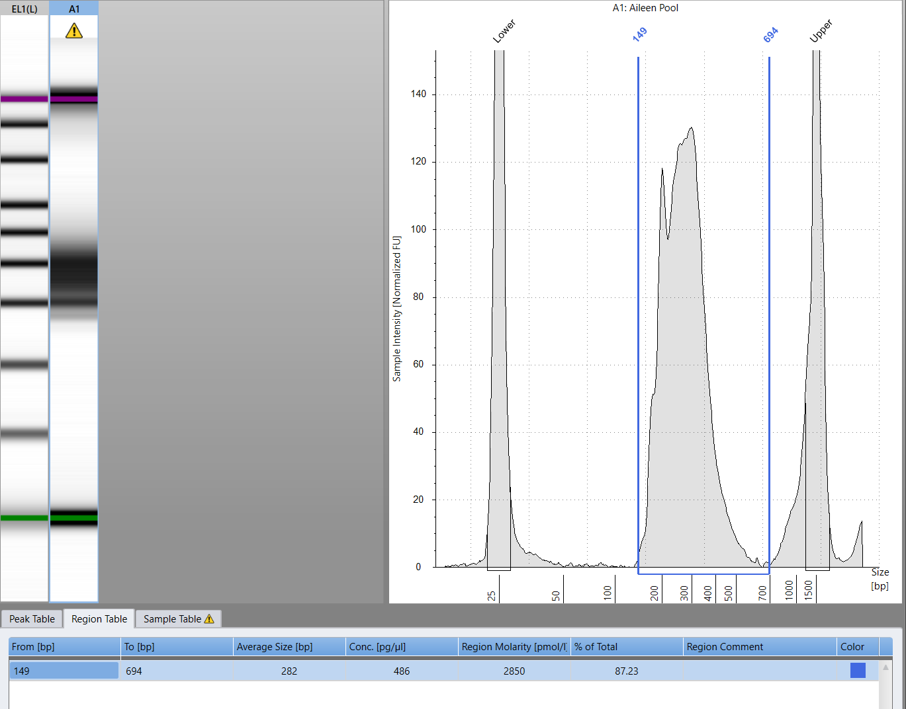

# Sequencing Pool Preparation

**Last updated:** 2026-05-22

## Overview

I decided that I will write a unified version of the preparation of your pool for the sequencing.

## Protocol:

### 1. Quantify individual libraries

Two measurements are needed:

1. Quantify each library by Qubit, write down the ng/ul measurement.

    !!! tip
        It is always recommended to prepare and measure new standards before each of your measurements prior/post pooling

2. Check size distribution by TapeStation. Mark the region of the tape between the 150 and 650 bp. Write down the average size (bp) and the region molarity divided by 1000- to convert them to $nM$ $\frac{\text{Region Molarity}}{1000}$

    <figure markdown="span">
      { width="600" }
      <figcaption>Example of the Measured TapeStation result with the marked region in the range we need.</figcaption>
    </figure>

!!! danger "Keep Attention!"
    Examine carefully your Pool. If it has a lot of Adapter Dimer Fragments ~155(bp)- perform a x0.8 SPRI cleanup. The same goes to very long fragments- reverse cleanup of x0.5 SPRI. If the concentration of your pool is really low <0.4-0.5 $ng/ul$ perform 1x SPRI cleanup and elute it in the lower volume to concentrate.

### 2.1 Sequencing with other groups

If you sequence with other groups they will ask you to provide them a pool of 2 $nM$ concentration:

Convert ng/µL → nM using the average fragment size from the tape and the qubit measurement:

$$
c\,[\text{nM}] = \frac{\text{concentration [ng/µL]}}{660 \times \text{average fragment size [bp]}} \times 10^6
$$

Using this concentration dilute your library to 2 nM. If not possible- concentrate first.

!!! note
    Always remeasure your pools after the dilutions (Qubit + Tape)

### 2.2 Sequencing with the Barkai Group

1. If you have >1 tube of pools mix them using the equation above, account for the number of reads per each pool. If possible dilute to 2-2.5 $nM$ for convenience. [Requantify the pool of pools](#1-quantify-individual-libraries)

2. Insert all of the needed info - Qubit measurement, Average Region Size (Tape), Region Molarity (divided by 1000) and Reads in the table (usually sent in the slack). The molarity Qubit, the mean conc (weighted- 0.8 Tape 0.2 Qubit) and the Volume for final pool will be calculated automatically.

| Samples | <u>conc(ng/ul)-Qubit</u> | <u>size-Tape</u> | <u>molarity(Tape)</u> | molarity Qubit | mean conc | <u>Reads (mio)</u> | Dilution | Volume for final pool |
|---------|---------------------|-------------|-----------------|----------------|-----------|-------------|----------|-----------------------|
| Your Pool | 0.274 | 282 | 0.5 | 1.472168493 | 0.7 | 52 | 1.0 | 10.9 |

### 3. Insert the Indexes you used in the table.

Insert all of the indexes used in your pool in the table for the demultiplexing after the run is done.

!!! danger
    This step is critical especially when you sequence with other groups. You don't want to mix-up the barcodes and also you want to get your data on time.

| barcode | Name | Lab | # Reads | Index1 name | Index1 sequence | Index2 name | Index2 sequence |
|---------|------|-----|---------|-------------|-----------------|-------------|-----------------|
| Unique_Sample_Name | Best Student | Barkai | 3 | 10F | CAATAGTC | Enr4 | TACTCCTT |

!!! warning
    Avoid using the $space$, '-', or other obscure symbols that machines cannot read in the sample name. If you have several repeats use _RepNumber.
---

## Notes

<!-- Add any lab-specific notes or deviations here -->
